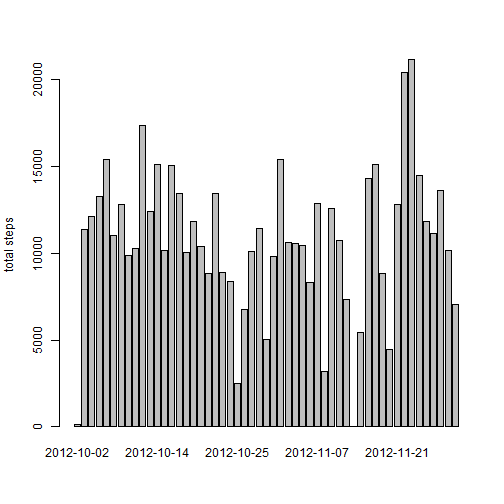
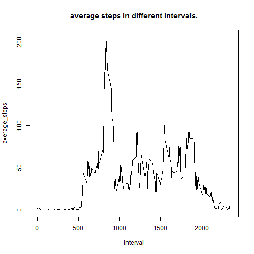
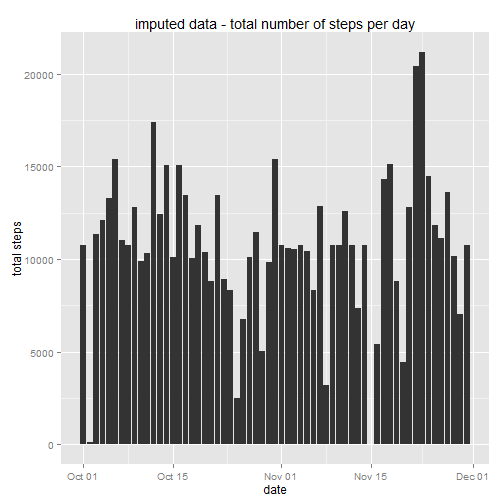
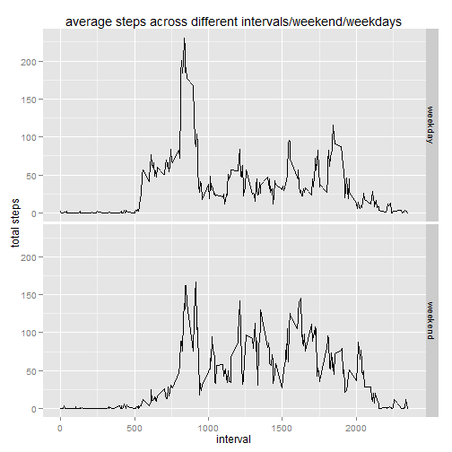

# Activity Monitoring - reproducible research


```r
# load the libraries
  library(data.table)
  library(dplyr)
  library(ggplot2)
```

  
### Loading and pre-processing the activity monitoring date.


```r
  unzip("activity.zip")
  
  activityData <- read.csv("activity.csv")
  # converting date from factors to date
  activityData$date <- as.Date(activityData$date, "%Y-%m-%d")
```
  
### plot for total number of steps per day

```r
  # ignoring the data with NAs
  completeData <- activityData[!is.na(activityData$steps), ]
  
  aggByDate <- aggregate(completeData$steps, by = list(completeData$date), FUN = sum)
  colnames(aggByDate) <- c("date", "totalSteps")
  
  hist(aggByDate$totalSteps, breaks = 15,
       xlim = c(0, 25000), ylim = c(0,20),
       xlab = "total steps",
       main = "histogram - total steps per day")
```

 

```r
  # mean
  meanSteps <- mean(aggByDate$totalSteps)
  
  # order the data for finding the mean.
  orderedData <- aggByDate[order(aggByDate$totalSteps),]
  medianSteps <- median(orderedData$totalSteps)
```
The mean number of steps taken per day are 1.0766189 &times; 10<sup>4</sup>.  
The median number of steps are 10765.

  
### What is the average daily activity pattern?

```r
  aggByInterval <- aggregate(completeData$steps, by = list(completeData$interval), FUN = mean)
  colnames(aggByInterval) <- c("interval", "averageSteps")
  
  plot(aggByInterval$interval, aggByInterval$averageSteps, type = "l", 
       xlab = "interval", ylab = "average_steps",
       main = "average steps in different intervals.")
```

 

```r
  # maximum average  number of steps
  maxSteps <- max(aggByInterval$averageSteps)
  maxStepInterval <- aggByInterval[ aggByInterval$averageSteps == maxSteps, "interval"]
```

The interval 835 has the highest average steps ( 206.1698113) across all days.

  
### Imputing missing values

```r
# total number of missing values in the dataset.
  missingValues = activityData[is.na(activityData$steps),]
  missingValuesCount = nrow(missingValues)
```
The total number of missing values are 2304.


```r
# filling missing value in any interval by getting the average steps for that interval across all days.
# creating a data.table for faster access.
  avgStepsByInterval <- data.table(aggByInterval)
  setkey(avgStepsByInterval, interval)
  
  # copy the data into a new data set.
  filledActData <- activityData
  
  # impute function
  extrapolatingFunction <- function(actData) {
    dataSteps <- as.numeric(actData["steps"])
    dataInterval <- as.numeric(actData["interval"])
    if (is.na(dataSteps)) {
      avgStepsByInterval[interval == dataInterval]$averageSteps
    }
    else {
      dataSteps
    }
  }

  imputedSteps <- apply(filledActData, 1, extrapolatingFunction)

  # filling the empty values in the new data set.
  filledActData$steps <- imputedSteps
```


```r
  # plot for imputedDataSet
  filledAggByDate <- aggregate(filledActData$steps, by = list(filledActData$date), FUN = sum)
  colnames(filledAggByDate) <- c("date", "totalSteps")
  
  hist(filledAggByDate$totalSteps, breaks = 15,
     xlim = c(0, 25000), ylim = c(0,25),
     xlab = "total steps",
     main = "histogram - imputed day total steps per day")
```

 

```r
  # finding mean
  filledMeanSteps <- mean(filledAggByDate$totalSteps)
  
  # finding median (ordering tthe data for finding the median)
  filledMedianSteps <- median(filledAggByDate[order(filledAggByDate$totalSteps), "totalSteps"])
```
The mean for filled data set is 1.0766189 &times; 10<sup>4</sup>.  
The median for filled data set is 1.0766189 &times; 10<sup>4</sup>.  
so we see that the mean is same as before, but the median has changed for the filled data set.

  
### Are there differences in activity patterns between weekdays and weekends?


```r
  # get the weekday and weekend as a column in the dataset.
  isWeekend <- grepl("^(Saturday|Sunday)$", weekdays(filledActData$date))
  # factor variable indicating weekday and weekend.
  isWeekend <- as.factor(isWeekend)
  levels(isWeekend) <- c("weekday", "weekend")

  filledActData <- mutate(filledActData, isWeekend)

  aggByIntervalAndWeekend <- aggregate(steps ~ interval + isWeekend, data = filledActData, mean)


  g <- ggplot(aggByIntervalAndWeekend, aes(x = interval, y = steps))
  g <- g + geom_line()
  g <- g + facet_grid(isWeekend ~ .)
  g <- g + labs(x = "interval", y = "total steps")
  g <- g + ggtitle("average steps across different intervals/weekend/weekdays")
  print(g)
```

 

